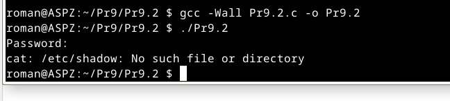
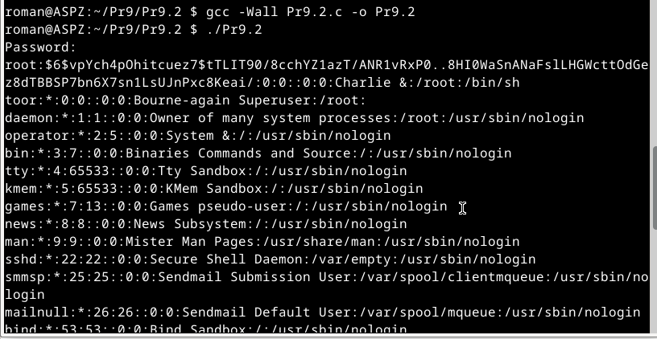
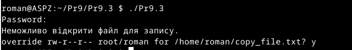
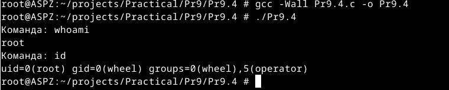
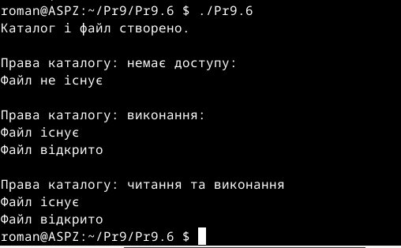

# Практична робота №9
Цей репозиторій cтворений для перегляду виконання практичної роботи №9 з дисципліни "Архітектура системного програмного забезпечення", виконане студентом Щур Р.І., групи ТВ-32.

## Завдання №1
  Напишіть програму, яка читає файл /etc/passwd за допомогою команди getent passwd, щоб дізнатись, які облікові записи визначені на вашому комп’ютері.
 Програма повинна визначити, чи є серед них звичайні користувачі (ідентифікатори UID повинні бути більші за 500 або 1000, залежно від вашого дистрибутива), окрім вас.

## Виконання

Реалізував виконання команди getent passwd через popen. Отриманий вивід оброблено порядковим зчитуванням кожного рядка в циклі, виділяючи ім'я користувача та його UID, ігноруючи при цьому поле пароля.Програма виводить всіх користувачів у яких UID більший за 1000.

## Завдання №2
 Напишіть програму, яка виконує команду cat /etc/shadow від імені адміністратора, хоча запускається від звичайного користувача.
 (Ваша програма повинна робити необхідне, виходячи з того, що конфігурація системи дозволяє отримувати адміністративний доступ за допомогою відповідної команди.)

## Виконання

shadow відсутній у FreeBSD,як альтернативу я використав master.passwd ,адже він зберігає інформацію про користувачів та їх паролі

## Завдання №3
Напишіть програму, яка від імені root копіює файл, який вона перед цим створила від імені звичайного користувача. Потім вона повинна помістити копію у домашній каталог звичайного користувача.
 Далі, використовуючи звичайний обліковий запис, програма намагається змінити файл і зберегти зміни. Що відбудеться?
 Після цього програма намагається видалити цей файл за допомогою команди rm. Що відбудеться?

## Виконання

Звичайний користувач не може змінювати файл створений root,проте він може його видаляти,якщо цей файл знаходиться в директорії,до якої користувач має права запису.

## Завдання №4
  Напишіть програму, яка по черзі виконує команди whoami та id, щоб перевірити стан облікового запису користувача, від імені якого вона запущена.
 Є ймовірність, що команда id виведе список різних груп, до яких ви належите. Програма повинна це продемонструвати.
## Виконання

Як і написано в завданні,команда id вивела список груп до яких належить користувач

## Завдання №24
Дослідіть, як права доступу до каталогу впливають на доступ до файлів у ньому.

## Виконання

Я проекспериментував із трьома варіантами доступу до каталогу та файлу в ньому: перший варіант — коли програма задає заборонений доступ для каталогу, після чого безуспішно намагається відкрити цей файл.Другий варіант — це права лише на виконання, при таких налаштуваннях програма може відкрити файл у директорії і третій варіант — коли права є і на читання, і на виконання, тоді програма аналогічно може відкрити файл.

