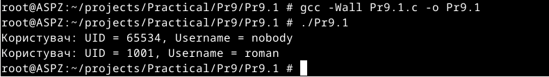

# Практична робота №9
Цей репозиторій cтворений для перегляду виконання практичної роботи №9 з дисципліни "Архітектура системного програмного забезпечення", виконане студентом Щур Р.І., групи ТВ-32.

## Завдання №1
  Напишіть програму, яка читає файл /etc/passwd за допомогою команди getent passwd, щоб дізнатись, які облікові записи визначені на вашому комп’ютері.
 Програма повинна визначити, чи є серед них звичайні користувачі (ідентифікатори UID повинні бути більші за 500 або 1000, залежно від вашого дистрибутива), окрім вас.

## Виконання

Реалізував виконання команди getent passwd через popen. Отриманий вивід оброблено порядковим зчитуванням кожного рядка в циклі, виділяючи ім'я користувача та його UID, ігноруючи при цьому поле пароля.Програма виводить всіх користувачів у яких UID більший за 1000.

## Завдання №2
Є файл, дескриптор якого — fd. Файл містить таку послідовність байтів: 4, 5, 2, 2, 3, 3, 7, 9, 1, 5. У програмі виконується наступна послідовність системних викликів:
lseek(fd, 3, SEEK_SET);
read(fd, &buffer, 4);
де виклик lseek переміщує покажчик на третій байт файлу. Що буде містити буфер після завершення виклику read? Наведіть робочий приклад програми, яка демонструє вашу відповідь.

## Виконання

Програма пропустить перші три байти файлу, покажчик переміститься на 3 байт. Потім вона зчитає 4 байти,адже в програмі вказано,що потрібно зчитати наступні 4 байти (read(fd, &buffer, 4);).

## Завдання №3
Бібліотечна функція qsort призначена для сортування даних будь-якого типу. Для її роботи необхідно підготувати функцію порівняння, яка викликається з qsort кожного разу, коли потрібно порівняти два значення.
 Оскільки значення можуть мати будь-який тип, у функцію порівняння передаються два вказівники типу void* на елементи, що порівнюються.
Напишіть програму, яка досліджує, які вхідні дані є найгіршими для алгоритму швидкого сортування. Спробуйте знайти кілька масивів даних, які змушують qsort працювати якнайповільніше. Автоматизуйте процес експериментування так, щоб підбір і аналіз вхідних даних виконувалися самостійно.
Придумайте і реалізуйте набір тестів для перевірки правильності функції qsort.

## Виконання

Я згенерував три види масивів чисел: один — рандомно згенерований, другий — вже відсортований, а третій — реверсивно відсортований (від більшого до меншого). Для обрахунку часу я використав спосіб із завдання з минулої практичної роботи. Результат показав, що якщо і є якась різниця в часі перевірки, то вона настільки мала, що практично не вимірюється.

## Завдання №4
 Виконайте наступну програму на мові програмування С:
int main() {
  int pid;
  pid = fork();
  printf("%d\n", pid);
}
Завершіть цю програму. Припускаючи, що виклик fork() був успішним, яким може бути результат виконання цієї програми?

## Виконання

fork() слугує для створення додаткового процесу,цей процес є копією головного процесу, fork() повертає значення PID головного і дочірнього процесу.

## Завдання №24
Змоделюйте затримку у write() при записі на повільний пристрій, щоб виміряти ефективність буферизації.

## Виконання

Функція delayed_write, імітує повільний пристрій,роблячи затримку при записі без буферизації , а для порівняння ефективності буферизації використав функцію fwrite, яка автоматично застосовує буферизацію.Результат виконання показав,що запис з буферизацією є більш ефективним.
